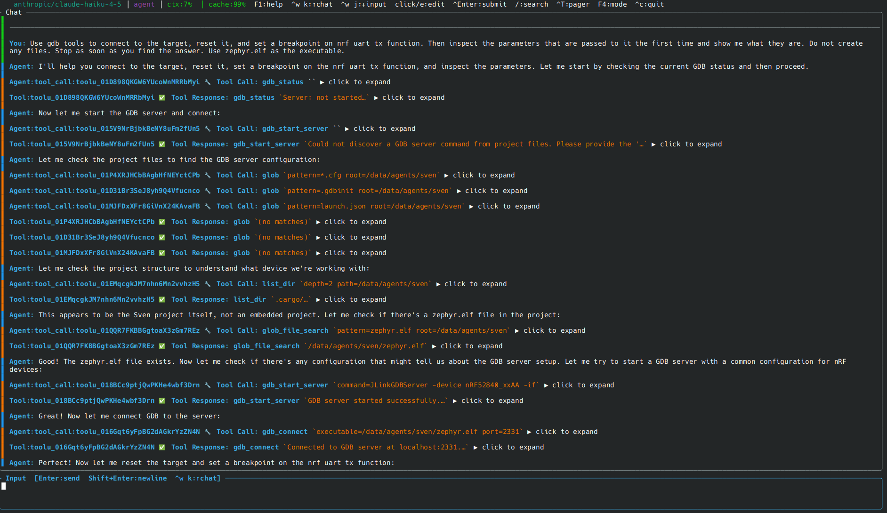
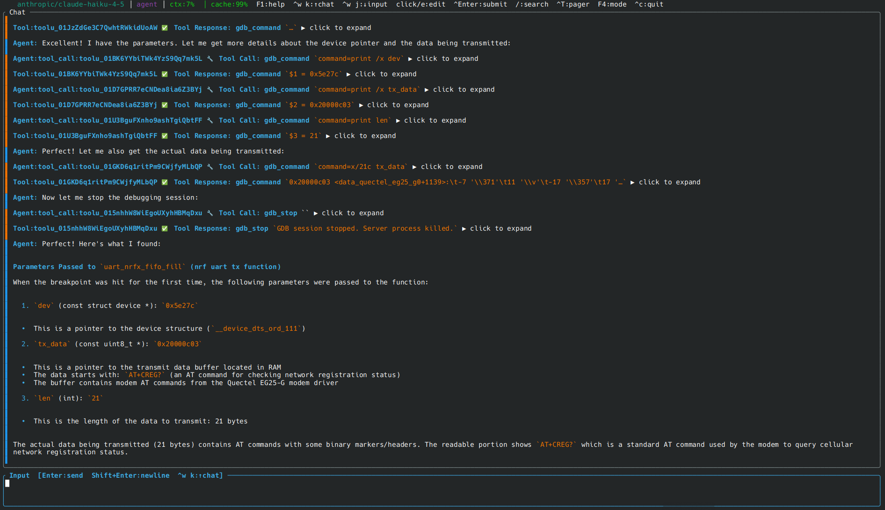
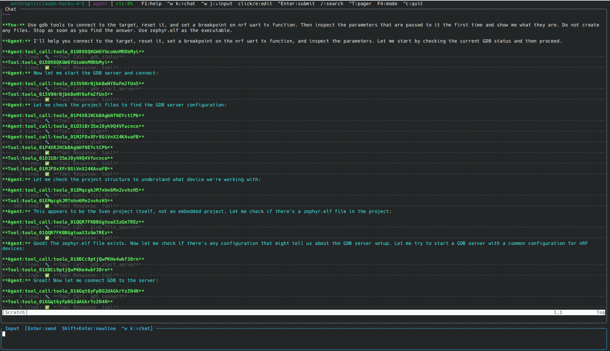

# User Guide

## The TUI in depth

### Layout

The TUI has four visual regions. The chat list sidebar on the right is optional
and can be toggled with `Ctrl+B`:

```
┌─────────────────────────────────────────┬───────────────────┐
│ gpt-4o  agent  ctx:18%  ⠿ run_terminal │ ● New chat        │  status bar
├─────────────────────────────────────────┤ ○ Rate limiter    │
│                                         │ ○ Codebase review │
│   chat pane                             │ ✓ Auth redesign   │
│   (scrollable conversation history)     │                   │
│                                         │ n:new d:del a:arch│
├─────────────────────────────────────────┤                   │
│ > type here and press Enter             │                   │
└─────────────────────────────────────────┴───────────────────┘
```

**Status bar** - always visible at the top. Shows:
- Model name (e.g. `gpt-4o`)
- Current agent mode (`research`, `plan`, or `agent`)
- Context usage as a percentage (`ctx:18%`)
- A spinner and the name of any tool currently running

**Chat pane** - the conversation history. User messages, agent responses, and
collapsed tool calls are all shown here. Scrolls independently of the input box.

**Input box** - a multi-line text field. Press `Enter` to send, `Shift+Enter`
to insert a newline.

**Chat list sidebar** - shows all open sessions. The active session is
highlighted. Sessions running a background agent task show a spinner. Toggle
with `Ctrl+B`.

---

### Focus and pane switching

The TUI has two focusable panes: the chat pane and the input box. Focus starts
on the input box.

Switch focus with the `Ctrl+W` chord:

| Sequence | Effect |
|----------|--------|
| `Ctrl+W` then `K` or `↑` | Focus the chat pane |
| `Ctrl+W` then `J` or `↓` | Focus the input box |

When the chat pane has focus, navigation keys work as described below. When the
input box has focus, all printable characters go to the text field.

---

### Chat list sidebar

The chat list sidebar lets you manage multiple concurrent conversations without
leaving the TUI. Each session runs its own independent agent task - you can
have one session researching a problem while another is implementing a fix.

**Opening and navigating the sidebar**

Press `Ctrl+B` to show the sidebar and give it keyboard focus. Press `Ctrl+B`
again (or `Esc`, `q`, `h`, or `←`) to return focus to the input box.

| Key | Action |
|-----|--------|
| `Ctrl+B` | Toggle sidebar visibility / focus |
| `j` / `↓` | Move selection down |
| `k` / `↑` | Move selection up |
| `Enter` / `l` / `→` | Switch to the selected session |
| `n` | Create a new empty session |
| `d` / `Delete` | Delete the selected session (cannot delete the active one) |
| `a` | Archive the selected session |
| `+` / `=` | Widen the sidebar |
| `-` | Narrow the sidebar |

**Session status icons**

| Icon | Meaning |
|------|---------|
| `⣾` (spinner) | Agent is currently running in this session |
| `●` | Active session, idle |
| `○` | Inactive session, idle |
| `✓` | Session completed |

**Per-session model and mode**

Each session keeps its own model and mode. Running `/model` or `/mode` in one
session does not affect any other session. New sessions always start with the
default model and mode from your configuration.

**Background sessions**

When you switch away from a session that has an agent running, it keeps running
in the background. The spinner in the sidebar shows which sessions are still
active. You can switch back at any time to see the results.

---

### Scrolling and navigation (chat pane)

First switch focus to the chat pane with `Ctrl+W K`.

| Key | Action |
|-----|--------|
| `j` / `↓` | Scroll down one line |
| `k` / `↑` | Scroll up one line |
| `J` | Scroll down one line (shift variant) |
| `K` | Scroll up one line (shift variant) |
| `Ctrl+D` | Scroll down half a page |
| `Ctrl+U` | Scroll up half a page |
| `g` | Jump to the very top |
| `G` | Jump to the very bottom |

---

### Search

Press `/` while the chat pane has focus to open the search bar at the bottom
of the screen. Type to filter the conversation in real time.

| Key | Action |
|-----|--------|
| `/` | Open search |
| `n` | Jump to next match |
| `N` | Jump to previous match |
| `Esc` or `Enter` | Close search and stay on the current match |

---

### Editing a past message

If you want to correct or rephrase a message you already sent, navigate to it
in the chat pane and press `e`. The message text appears in the input box for
editing. When you are happy with the change, press `Enter` to re-submit it as
if it were a new message. Press `Esc` to cancel and restore the original.

---

### Full-screen pager

Press `Ctrl+T` to open the full-screen pager. This expands the chat history to
fill the whole terminal, which is useful for reading long responses or code
blocks without the input box taking up space. Press `Esc` or `q` to close the
pager.

---

### Help overlay

Press `F1` to toggle the in-app help overlay, which lists all key bindings.

---

### Neovim integration

By default, sven embeds a headless Neovim instance and uses it as the chat
buffer. This gives the chat pane full Neovim editing capabilities:

- Navigate and scroll the chat with all standard Neovim motions
- Use `:q` or `:qa` to quit sven
- Press `Ctrl+Enter` from the chat pane to submit the buffer content as a
  message

Sven defaults to the plain ratatui view.  To enable the embedded Neovim chat
pane instead, pass `--nvim`:

```sh
sven --nvim
```

In the default ratatui mode, tool calls and thinking blocks in the history are
collapsed by default to keep the view compact.

---

## Agent modes in practice

Modes control both the state machine that drives the session and the tools the
agent is allowed to use. Choosing the right mode prevents unintended changes and
gives you the right level of formality for the task.

### `chat` - conversational coding assistant (default)

`chat` (along with `agent` and `reactive`) is powered by the
`ReactiveAgentMachine`. It runs a streaming, native-tool-calling agent loop: the
model reasons, calls tools (read, search, edit, shell, …) that are executed and
fed back, and streams its answer. For quick questions, code review, exploratory
analysis, and edits, this is the right mode.

```sh
sven "What does the authentication module do?"
sven "Explain the race condition in this code."
```

The agentic model↔tool loop that powers a single turn is the same reusable
`Deliberator` engine described in
[Deliberation Engine](technical/deliberation-engine.md).

### `sdlc` - software development lifecycle

`sdlc` is powered by the `SdlcMachine` - a deliberation-driven HSM that encodes
the engineering lifecycle as a sequence of phases, each of which runs its own
scoped LLM↔tool deliberation on an append-only conversation thread and returns a
structured decision that drives the next transition:

```
Idle → Intake → Discovery → Planning → Execution → Verification → Delivery
                   │                                                  │
                   └──────────────── Recovery ◀──────────────────────┘
```

**Intake guard**: `Intake` classifies your request before any work happens.
Chit-chat or under-specified requests keep the machine in `Intake` and ask
clarifying questions; only a confirmed, actionable scope advances to `Discovery`.

**Human gates**: phases pause for you via real question and approval gates
(scope, plan, and delivery). The TUI shows the prompt; you answer or
approve/reject. In CI / headless mode (`RuntimeRunner`) these gates are
auto-approved so a run completes unattended.

**Parallel execution**: `Execution` decomposes the plan and fans out one
concurrent child kernel per task, then merges the child summaries back into the
parent thread. See [Parallel Submachine Fan-out](technical/parallel-submachines.md).

**Recovery**: when a deliberation reports failure, the hierarchy routes to a
`Recovery` phase that diagnoses and decides whether to retry or abort.

For the full design - the decision envelope, per-state tools and models, and the
append-only / cache-safe thread invariant - see the
[Deliberation Engine](technical/deliberation-engine.md) reference.

Use `sdlc` when you want sven to implement a feature end-to-end with full
traceability, or when you need the approval gate for safety:

```sh
sven --mode sdlc "Add rate limiting to the API."
SVEN_MODE=sdlc sven --file plan.md
```

### `research` - safe exploration

The agent can only read. It can run commands like `ls`, `cat`, `grep`, and
`find`, but cannot write to any file.

```sh
sven --mode research "What does the authentication module do?"
```

### `plan` - structured proposals

The agent reads freely and produces a written plan but does not write any
files. Use this before an `agent` or `sdlc` run to review what will happen.

```sh
sven --mode plan "Design a rate-limiting layer for the API."
```

### `agent` - full access

The agent can read, write, delete files and run any command. Use for
general-purpose agentic tasks where the formal SDLC structure is not needed.

```sh
sven "Implement the rate-limiting layer described in the plan."
```

### Cycling modes live

Press `F4` inside the TUI to cycle through `research → plan → agent → research`.
For `chat` and `sdlc`, use the `/mode` command or restart with `--mode`.

### Human approval in the TUI

When the `sdlc` machine (or any machine emitting `RequestHumanApproval`)
reaches an approval gate, the TUI enters `AwaitingApproval` mode and shows a
modal with the proposed change description. Key bindings:

| Key | Action |
|-----|--------|
| `y` / `Enter` | Approve - machine continues into `ApplyPatch` |
| `n` / `Esc` | Reject - machine enters `Recovery` |

---

## Tools and approvals

sven has a set of built-in tools it can call to complete tasks:

| Tool | What it does |
|------|-------------|
| `read_file` | Read a file (images are detected and attached) |
| `write_file` | Create or overwrite a file |
| `edit_file` | Edit part of a file |
| `attach_file` | Put an image, audio file or PDF into the model's context |
| `find_file` | Find files by name pattern |
| `grep` | Search file contents, in one file or the whole project |
| `shell` | Run a shell command (also how files are deleted and directories listed) |
| `web_fetch` | Fetch a URL |
| `web_search` | Search the web |
| `task` | Delegate a self-contained subtask to a sub-agent |
| `context` | Work with content larger than the context window |
| `memory` | Key-value notes and project knowledge documents |
| `semantic_memory` | Remember and recall facts across sessions |
| `todo` | Read or update the task list for the current session (call with no args to read) |
| `skill` | Load a skill's instructions |
| `system` | Change the agent mode or model mid-session |
| `ask_question` | Ask you a clarifying question (interactive sessions) |
| `gdb` | Drive a GDB debugging session (offered when the project has GDB configuration) |

### GDB debugging tools

Sven is the **first AI agent with native GDB integration** for autonomous
embedded hardware debugging. Give it a plain-English task and it handles the
entire debug lifecycle - from starting the server and loading firmware through
setting breakpoints, inspecting state, and cleaning up - without any manual
intervention.

The five GDB tools form a lifecycle:

```
gdb_start_server → gdb_connect → gdb_command / gdb_interrupt → gdb_stop
```

The screenshots below show a real session: the user asks sven to find the
parameters passed to an nRF UART TX function, and the agent works through the
full debug cycle autonomously.

**Task start and target discovery** (ratatui TUI):



**Inspecting parameters and final summary** (ratatui TUI):



**Same session in the embedded Neovim view**:



**Starting a server**

If you do not supply a command, sven searches your project for configuration
hints in this order:

1. `.gdbinit` - looks for `# JLinkGDBServer ...` comments or `target remote` lines
2. `.vscode/launch.json` - reads `debugServerPath`, `debugServerArgs`, and `servertype`
3. `openocd.cfg` - builds an OpenOCD command from the config file
4. `platformio.ini` - reads `debug_server` or `debug_tool`
5. `CMakeLists.txt` / `Cargo.toml` - matches MCU family names (STM32, AT32, NRF, ...)

If discovery fails, sven asks the user for the target device name.

**Example session**

```
User: Flash and debug my firmware. The device is an AT32F435RMT7.

Agent calls:
  gdb_start_server {"target": "AT32F435RMT7"}
  gdb_connect      {"executable": "build/firmware.elf"}
  gdb_command      {"command": "load"}
  gdb_command      {"command": "break main"}
  gdb_command      {"command": "continue"}
  gdb_command      {"command": "info registers"}
  gdb_stop
```

### Approval policy

Before running a shell command, sven checks it against approval rules:

- **Auto-approved** patterns run without prompting (e.g. `cat *`, `ls *`,
  `grep *`).
- **Denied** patterns are blocked outright (e.g. `rm -rf /*`).
- Everything else is presented for confirmation if the agent requests it.

You can customise these patterns in the configuration file - see
[Configuration](05-configuration.md).

---

## Conversation management

### Multiple sessions inside the TUI

You can run several conversations simultaneously without restarting sven. Open
the chat list sidebar with `Ctrl+B` and press `n` to create a new session, or
use the `/new` command from the input box. Switch between sessions by selecting
one and pressing `Enter`.

Each session has its own:
- Conversation history
- Agent task (background sessions keep running while you work elsewhere)
- Model and mode settings (changed with `/model` and `/mode`)

All sessions are automatically saved to `~/.config/sven/history/` as YAML files
and restored the next time you launch sven.

### Starting and continuing conversations from the CLI

To list saved conversations:

```sh
sven chats
```

Output:

```
ID (use with --resume)                          DATE              TURNS  TITLE
-----------------------------------------------------------------------------------------------
3f4a...                                         2025-01-15 10:42  12     Codebase analysis
a1b2...                                         2025-01-14 09:11  5      Rate limiter design
```

To resume a session, pass its ID (or a unique prefix) to `--resume`:

```sh
sven --resume 3f4a
```

If you omit the ID entirely, sven opens an interactive fuzzy-finder (requires
`fzf`) so you can pick the session visually:

```sh
sven --resume
```

### Conversation files

For longer-running work, a conversation file gives you a plain-text record that
you can edit directly. See [Quick Start](02-quickstart.md) for an introduction,
and [CI and Pipelines](04-ci-pipeline.md) for the full file format.

---

## Scripting an agent a step at a time

`sven agent step` runs an agent for exactly one turn and exits, keeping
everything durable in a state file:

```sh
sven agent step --state ./review.json "read src/lib.rs and summarise it"
sven agent step --state ./review.json "now list its public types"
```

Each command is a separate process. The agent is loaded from the file,
advanced by one step, written back, and dropped - so a shell script, a cron
job or a web handler can drive a long conversation without holding anything
open between turns.

| Flag | Meaning |
|------|---------|
| `--state <file>` | Load from and write back to this file. Omit it for a one-off step that keeps nothing. |
| `--mode <mode>` | Which machine to run. Only used when starting fresh; a resumed agent keeps its own. |
| `--role <text>` | A stable system prompt for the agent. |
| `--yes` | Approve permission gates instead of refusing them. Off by default. |

Without `--yes` every approval gate is **refused**, so a step running
unattended cannot be talked into a dangerous capability. Pass it only where the
workspace is already disposable.

A state file that exists but cannot be read is an error rather than a fresh
start: silently discarding a conversation would only show up later, as an agent
that had inexplicably forgotten everything.

To build this into your own program rather than script it, see
[the SDK](technical/sdk.md).

## Context and compaction

Every message you send, every tool call, and every response is stored in the
conversation context. Language models have a finite context window, and when
the conversation grows long enough, older messages must be summarised to make
room for new ones.

sven tracks context usage and shows it in the status bar (`ctx:X%`). When usage
reaches the configured threshold (85% by default), sven automatically compacts
the oldest part of the conversation into a short summary before sending the
next message. This happens transparently in the background.

You will not lose any information that sven has already used; compaction only
affects how much raw history the model can see at once.

---

## Interrupting the agent

If the agent is in the middle of a long task and you want to stop it, press
`Ctrl+C` from the input box. The current tool call is cancelled and sven
returns to idle, ready for your next message.

---

## Slash commands

Type `/` in the input box to see all available commands. Tab-completion works
for both command names and their arguments.

### Built-in commands

| Command | Description |
|---------|-------------|
| `/new` | Start a new chat session. A fresh tab appears in the sidebar with its own isolated agent, model, and mode. |
| `/clear` | Clear the current session's message history. The session itself stays open; only the visible conversation is erased. |
| `/model <provider/name>` | Switch the model for this session (e.g. `/model anthropic/claude-opus-4-6`). Tab-completes over your configured models. The switch takes effect on the next message you send. |
| `/mode <research\|plan\|agent>` | Switch the agent mode for this session. Tab-completes all three modes. |
| `/provider <name>` | Switch provider while keeping the current model name. |
| `/abort` | Abort the current agent turn. Queued messages stay queued; partial output is preserved. |
| `/refresh` | Re-scan skill directories and register any newly added skills as commands. |
| `/skills` | Open the skills inspector - a browsable tree of all loaded skills. |
| `/subagents` | Show all configured subagents with their descriptions, models, and paths. |
| `/peers` | Show active subagent subprocess buffers and configured team agents. |
| `/context` | Show the current agent context: project root, skill and agent counts, output buffer handles. |
| `/tools` | Show all available tools with descriptions and parameter counts. |
| `/approve [task_id]` | Approve a teammate's pending plan (team mode). |
| `/reject [task_id] [reason]` | Reject a plan with feedback (team mode). |
| `/agents` | Show the team members overlay (also `Ctrl+A`). |
| `/tasks` | Show the current team task list (also `Alt+T`). |
| `/quit` | Exit sven. In the Neovim buffer, use `:q` or `:qa`. |

### Custom commands

Every markdown file in a `commands/` directory (`.sven/commands/`,
`.cursor/commands/`, `.claude/commands/`, `.codex/commands/` or
`.agents/commands/`, in your project or a parent directory) is a slash command
named after its path without the `.md` extension - for example
`.sven/commands/review-code.md` → `/review-code` and
`.sven/commands/sven/plan.md` → `/sven/plan`. Submitting the command sends the
file's content as your message; any text after the command is appended as
`Task: <text>`:

```
/sven/plan analyse the authentication module
```

Skills are not slash commands - see the [Skills](#skills) section.

---

## Skills

Skills are instruction packages that teach sven how to handle a specific type
of task.  Each skill lives in its own directory alongside any helper scripts or
reference files it needs.  When you invoke a skill, sven loads its instructions
and follows them for your task.

Skills are discovered automatically from your project and home directory on
startup.  You do not need to configure anything; drop a skill directory in the
right place and it appears immediately.

---

### Using a skill

Skills are not registered as slash commands. The model sees every discovered
skill's name and description in its system prompt and loads the matching one
with the `skill` tool when your request fits. To use a specific skill, name it
in your message:

```
Use the sven/plan skill to analyse the authentication module
```

For a reusable `/command`, put a markdown file in a `commands/` directory
instead (see [Custom commands](#custom-commands)).

---

### Hierarchical skills

Skills can be nested.  A top-level skill like `sven` describes a high-level
workflow and lists the sub-skills that handle each phase.  Each sub-skill is
also a skill in its own right, loadable by its command (`sven/plan`,
`sven/implement`, `sven/review`).

When the model loads a parent skill, it receives a compact list of the
available sub-skills.  It then loads `sven/plan` etc. with the `skill` tool exactly
when it enters each phase - not before.  This means sub-skill instructions are
loaded only when actually needed, keeping each turn's token usage minimal.

---

### Where to put skills

Sven looks for skills in the following locations, with later sources taking
precedence when the same command exists in multiple places:

| Location | When to use |
|----------|-------------|
| `~/.sven/skills/` | Your personal skills, available in every project |
| `~/.agents/skills/` | Cross-agent skills shared with other agents |
| `<project>/.sven/skills/` | Skills specific to this project |
| `<project>/.agents/skills/` | Project skills shared with other agents |

Project-level skills always win over global ones.

---

### Creating a skill

A skill is a directory containing a `SKILL.md` file:

```
.sven/skills/
└── deploy/
    ├── SKILL.md
    └── scripts/
        └── pre-flight.sh
```

`SKILL.md` starts with a YAML frontmatter block followed by the instruction
body:

```markdown
---
description: |
  Use this skill when the user asks to deploy, release, or ship the application.
  Trigger phrases: "deploy", "release", "ship to production".
name: Deploy             # optional - defaults to directory name
version: 1.0.0           # optional
---

# Deploy

Before deploying, run the pre-flight checklist in scripts/pre-flight.sh.

1. Confirm the target environment with the user.
2. Run `scripts/pre-flight.sh` and fix any failures.
3. Build the release artefact.
4. Push and tag.
```

The `description` field is the only required frontmatter key.  The model reads
it to decide whether to use the skill, so write it as a list of trigger phrases
and use-cases rather than a technical summary.

---

### Creating a hierarchical skill

Nest sub-skill directories inside the parent:

```
.sven/skills/
└── deploy/
    ├── SKILL.md              /deploy
    ├── pre-flight/
    │   └── SKILL.md          /deploy/pre-flight
    └── rollback/
        └── SKILL.md          /deploy/rollback
```

In the parent `SKILL.md`, tell the model to load sub-skills at the right time:

```markdown
---
description: |
  Full deployment workflow. Use when deploying to any environment.
---

# Deploy Workflow

Follow these phases in order:

1. Pre-flight checks - load the `deploy/pre-flight` skill before touching
   any infrastructure.
2. Deploy the artefact.
3. If anything fails - load the `deploy/rollback` skill immediately.
```

Sub-skills are automatically listed to the model when the parent is loaded, so
you do not need to declare them in the frontmatter.  Just create the directory.

---

### Frontmatter reference

| Key | Type | Required | Description |
|-----|------|----------|-------------|
| `description` | string | **yes** | Trigger phrases and use-cases. The model matches this against the user's request. |
| `name` | string | no | Human-readable label shown in the UI. Defaults to the directory name. |
| `version` | string | no | Semver version string for your own tracking. |
| `sven.always` | bool | no | Always include this skill's metadata in the system prompt, regardless of the token budget. Useful for a project-wide coding-style skill. Default: `false`. |
| `sven.requires_bins` | list | no | Skip this skill if any of the listed binaries are absent from `PATH` (e.g. `[docker, kubectl]`). |
| `sven.requires_env` | list | no | Skip this skill if any of the listed environment variables are unset (e.g. `[AWS_PROFILE]`). |
| `sven.user_invocable_only` | bool | no | Hide the skill from the model's skill listings, so it is loaded only when you name it. Use for skills you always want to invoke deliberately. Default: `false`. |

---

### Bundled files

Any file in a skill directory that is not a `SKILL.md` is a **bundled file** -
a script, reference document, template, or data file the skill's instructions
may use.  Subdirectories without their own `SKILL.md` are support directories,
not sub-skills.

When a skill is loaded, the agent receives a listing of up to
20 bundled file paths relative to the skill directory.  The skill body can
reference them:

```markdown
Run the helper at `scripts/validate.py` before proceeding.
```

The agent resolves that path against the base directory shown in the tool
response and reads the file with `read_file`.

---

### Tips

**Write descriptions as trigger phrases.**  The model matches the description
against what the user asked.  `"Use when deploying to production"` is more
useful than `"Deployment skill"`.

**Keep parent bodies short.**  The parent skill should describe the workflow
and tell the model *when* to call each sub-skill.  Put the detailed instructions
in the sub-skills.

**Use `always: true` sparingly.**  Skills marked `always` are included in every
system prompt.  Reserve this for genuinely project-wide rules (e.g. a coding
style guide) rather than task-specific workflows.

**Use `user_invocable_only: true` for personal workflows.**  If a skill
contains steps you always want to review before running (e.g. a production
deployment), mark it `user_invocable_only` so the model never triggers it
automatically.

**Override globals with project skills.**  A project-level skill at
`.sven/skills/deploy/` silently replaces any global skill with the same command.
This lets you tailor shared skills for a specific repository.

---

## Agent routing convention

For projects with multiple specialist agents or skills, a routing table in the
project context file (`AGENTS.md` or `.sven/context.md`) encodes which domain
expert to consult before editing a given area of the codebase.

The agent reads this table as part of "Project Instructions" and follows it
automatically - no additional tooling required.

### Format

Add an `## Agent Routing` section to your `AGENTS.md`:

```markdown
## Agent Routing

Before modifying files that match the patterns below, load the indicated skill
or agent first.

| File pattern              | Before changes: load              |
|---------------------------|-----------------------------------|
| crates/hsm/**        | `/hsm-specialist`                 |
| crates/model/**      | `/model-integrator`               |
| .sven/knowledge/**        | update `updated:` date when done  |
| src/auth/**               | `/security-auditor` (readonly)    |
```

### Why it works

The routing table is written for the AI, not for humans.  When Sven sees
"Project Instructions" in its system prompt, it treats the table as binding
rules.  The model will load the skill or suggest the indicated agent before
touching matching files.

### Tips

- **Use glob patterns.** `crates/hsm/**` matches any file under that
  directory; `src/**/*.rs` matches all Rust source files.
- **Cross-reference with knowledge docs.** If a subsystem has a knowledge doc,
  note it in the routing table:
  ```markdown
  | crates/hsm/**  | search_knowledge "HSM Kernel" before changes |
  ```
- **Combine with skills.** Skills can themselves contain routing sub-tables
  for their own sub-components.
- **Start small.** A two-row routing table covering your two most error-prone
  subsystems is more effective than a twenty-row table the model ignores due
  to length.

## IDE integration via ACP

Sven implements the [Agent Client Protocol (ACP)](https://agentclientprotocol.org),
so ACP-aware editors can launch it as a subprocess and interact with it as a
first-class AI coding agent - with streaming output, tool-call visibility, plan
updates, and mode switching - all without a separate daemon or relay.

> Sven manages its own language model configuration (`~/.config/sven/config.yaml`).
> You do **not** need to configure a language model inside the IDE; the "no language
> model configured" prompt that some IDEs show before connecting an ACP agent can be
> ignored or dismissed.

### Zed

Add to `~/.config/zed/settings.json`:

```json
{
  "agent_servers": {
    "sven": {
      "type": "custom",
      "command": "sven",
      "args": ["acp", "serve"]
    }
  }
}
```

Open the assistant panel and select **sven** from the agent picker.

### VS Code (ACP extension)

Add to `.vscode/settings.json` or your user settings:

```json
{
  "acp.agents": [
    {
      "id": "sven",
      "name": "Sven",
      "command": "sven",
      "args": ["acp", "serve"]
    }
  ]
}
```

### JetBrains IDEs (AI Assistant / ACP plugin)

Open **Settings → Tools → ACP Agents** and create a new entry:

| Field     | Value           |
|-----------|-----------------|
| Name      | Sven            |
| Command   | `sven`          |
| Arguments | `acp serve`     |

### What the IDE sees

Once connected, the IDE assistant panel provides:

| Feature | Description |
|---------|-------------|
| Streaming text | Responses appear word-by-word as the model generates them |
| Tool calls | Every file read/write/shell command is shown with its status |
| Plan | Sven's todo list surfaces as a structured plan panel |
| Mode switching | Switch between `agent`, `plan`, and `research` without restarting |

See [docs/technical/acp.md](technical/acp.md) for the full protocol reference.
