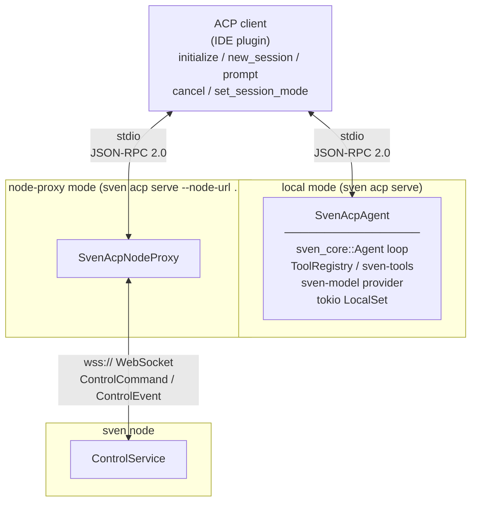

# ACP – Agent Client Protocol integration

Sven implements the [Agent Client Protocol (ACP)](https://agentclientprotocol.org) so that ACP-aware editors (JetBrains, Zed, VS Code with the ACP extension, etc.) can drive it directly over a stdio JSON-RPC 2.0 transport without any additional daemon or relay.

## Architecture

Two modes are available, mirroring the existing MCP integration:



### Local mode (`sven acp serve`)

The process reads the sven configuration (`~/.config/sven/config.yaml`), builds a fresh `sven_core::Agent` per ACP session, and drives it directly.  Notifications (text deltas, tool calls, plan updates, mode changes) are streamed back to the client as `session/notification` messages.

This is the recommended mode for single-developer use.

### Node-proxy mode (`sven acp serve --node-url … --token …`)

The process connects to a running `sven node` over WebSocket using the existing `ControlCommand`/`ControlEvent` protocol.  It translates every ACP RPC call into the corresponding node control command and forwards node events back as ACP notifications.

Use this mode when a `sven node` is already running (e.g. a CI orchestrator or a shared team node) and you want an IDE to attach to it without starting a second agent process.

## Running

### Local mode

```sh
# Start the ACP agent server (blocks until the IDE disconnects)
sven acp serve
```

### Node-proxy mode

```sh
# Connect to an existing sven node
sven acp serve \
  --node-url wss://localhost:8443 \
  --token "$SVEN_NODE_TOKEN"

# The token can also be supplied via the environment variable
export SVEN_NODE_TOKEN=<token>
sven acp serve --node-url wss://localhost:8443
```

## IDE configuration

### VS Code (ACP extension)

Add to `.vscode/settings.json` or user settings:

```json
{
  "acp.agents": [
    {
      "id": "sven",
      "name": "Sven",
      "command": "sven",
      "args": ["acp", "serve"],
      "env": {}
    }
  ]
}
```

For node-proxy mode:

```json
{
  "acp.agents": [
    {
      "id": "sven-node",
      "name": "Sven (node)",
      "command": "sven",
      "args": ["acp", "serve", "--node-url", "wss://localhost:8443"],
      "env": {
        "SVEN_NODE_TOKEN": "<token>"
      }
    }
  ]
}
```

### JetBrains IDEs (AI Assistant / ACP plugin)

Open **Settings → Tools → ACP Agents** and add a new entry:

| Field       | Value                                   |
|-------------|------------------------------------------|
| Name        | Sven                                     |
| Command     | `sven`                                   |
| Arguments   | `acp serve`                              |
| Environment | *(empty for local; `SVEN_NODE_TOKEN=…` for proxy)* |

For node-proxy, add `--node-url wss://…` to the Arguments field.

### Zed

Add to `~/.config/zed/settings.json`:

```json
{
  "assistant": {
    "enabled": true,
    "provider": {
      "type": "acp",
      "command": "sven",
      "args": ["acp", "serve"]
    }
  }
}
```

## Session modes

Each session advertises three modes that map 1-to-1 to sven's internal `AgentMode`:

| ACP mode ID  | Sven `AgentMode` | Behaviour                                               |
|-------------|------------------|---------------------------------------------------------|
| `agent`     | `Agent`          | Full agentic mode: reads, writes, executes tools autonomously |
| `plan`      | `Plan`           | Proposes changes without writing files                  |
| `research`  | `Research`       | Reads and searches; no file writes                      |

Clients can switch modes at any time using the `session/setMode` RPC call.  Sven acknowledges the switch and reflects it back via a `CurrentModeUpdate` notification.

## Event mapping

The bridge layer in `crates/sven-acp/src/bridge.rs` translates sven's internal `AgentEvent` stream into ACP `SessionUpdate` notifications:

| `sven_core::AgentEvent`          | ACP `SessionUpdate`             |
|----------------------------------|---------------------------------|
| `TextDelta(s)` / `TextComplete(s)` | `AgentMessageChunk`           |
| `ThinkingDelta(s)` / `ThinkingComplete(s)` | `AgentThoughtChunk`  |
| `ToolCallStarted(tc)`            | `ToolCall` (status: InProgress) |
| `ToolCallFinished { … }`         | `ToolCall` (status: Completed/Failed) |
| `TodoUpdate(todos)`              | `Plan`                          |
| `ModeChanged(mode)`              | `CurrentModeUpdate`             |
| `Error(msg)`                     | `AgentMessageChunk` (prefixed `[error]`) |
| `TurnComplete` / `Aborted`       | *(no notification; closes prompt response)* |

Events not listed above (e.g. `TokenUsage`, `ContextCompacted`, collab events) are silently dropped; they carry no information that ACP clients currently consume.

## Concurrency model

The ACP trait requires `?Send` futures, so the entire server runs inside a `tokio::task::LocalSet`.  Session state is held in a `RefCell<HashMap<…>>` (safe because `LocalSet` is single-threaded).  Each `sven_core::Agent` is wrapped in a `tokio::sync::Mutex` to prevent concurrent prompts on the same session, and cancellation is implemented via a `oneshot` channel stored inside the session entry.

Notifications flow through a `mpsc::UnboundedSender<ConnMessage>` that is shared between the agent task and the I/O forwarding task.  The I/O task calls `AgentSideConnection::session_notification` (from the `acp::Client` trait) and sends an acknowledgement back to the agent task before processing the next event.
