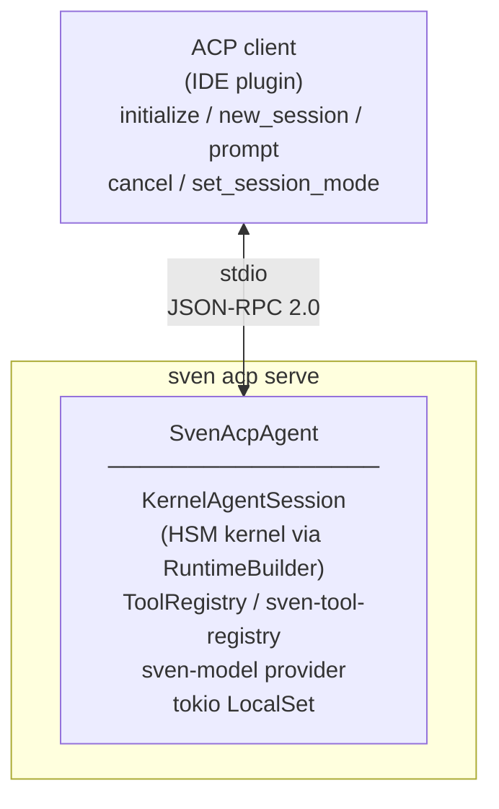

# ACP - Agent Client Protocol integration

Sven implements the [Agent Client Protocol (ACP)](https://agentclientprotocol.org) so that ACP-aware editors (JetBrains, Zed, VS Code with the ACP extension, etc.) can drive it directly over a stdio JSON-RPC 2.0 transport without any additional daemon or relay.

## Architecture

The server runs in-process, mirroring the existing MCP integration:


```mermaid
flowchart TD
    IDE["ACP client\n(IDE plugin)\ninitialize / new_session / prompt\ncancel / set_session_mode"]

    IDE <-->|"stdio\nJSON-RPC 2.0"| LOCAL

    subgraph local ["sven acp serve"]
        LOCAL["SvenAcpAgent\n─────────────────\nKernelAgentSession\n(HSM kernel via RuntimeBuilder)\nToolRegistry / sven-tool-registry\nsven-model provider\ntokio LocalSet"]
    end
```

### `sven acp serve`

The process reads the sven configuration (`~/.config/sven/config.yaml`), builds a fresh kernel session per ACP session (`sven_bootstrap::RuntimeBuilder`, wrapped in a `KernelAgentSession`), and drives it directly.  Notifications (text deltas, tool calls, plan updates, mode changes) are streamed back to the client as `session/notification` messages.

## Running

```sh
# Start the ACP agent server (blocks until the IDE disconnects)
sven acp serve
```

`--model` and `--provider` override the configured model. Three flags bound
the server, each only lowering what the configuration allows; the `task`
tool passes its sub-agent's budgets through them:

| Flag | Effect |
|------|--------|
| `--max-tool-rounds N` | `agent.max_tool_rounds` becomes at most `N` |
| `--max-output-tokens TOKENS` | the model's output-token cap becomes at most `TOKENS` |
| `--wall-clock-secs SECS` | the server, and every session in it, stops after `SECS` seconds |
| `--disable-tool NAME` | the sessions never offer nor run `NAME` (repeatable; adds to `tools.disabled`) |
| `--permission-timeout-secs SECS` | a tool call waits `SECS` for the client's permission answer before it is denied (default 60, at least 1) |
| `--approval auto\|manual` | whose policy decides which calls go to the client (see below; default `auto`) |
| `--command-patterns JSON` | replaces `tools.deny_patterns` and `tools.auto_approve_patterns` with `{"deny": [...], "auto_approve": [...]}` |

Under `--approval auto` (the default) the agent's own gate asks nobody, and
a tool whose policy is `Ask` (`shell`, `write_file`, `edit_file`, MCP tools,
...) is put to the client with `session/request_permission` - the client's
choice whether to ask its user. Under `--approval manual` every call that is
not read-only is put to the client instead. Every request names the
capability the call exercises in its `_meta` (`"sven.capability":
"WriteFile"`, ...). Either way a call is denied if no answer arrives within the permission
timeout, so a client that never answers never stalls the session. The `task`
tool starts its sub-agents with the parent's approval mode and command
patterns, so a manual parent sees every call of its sub-agent that is not
read-only.

`session/set_mode` rebuilds the session in the new mode, carrying the
conversation, its working directory, its model and its MCP servers: the
mode's policy and tools apply, so a session switched to `research` has no
writing tools. It is refused with an `Invalid request` error while a prompt
turn is running on the session; wait for the turn to end or cancel it
first. A model the agent switches to (`system` switch_model) takes effect
from the session's next turn.

ACP carries no question from the agent to the client, so an explicit question
(an SDLC `need_user_input`) is answered at once: "No user is available to
answer this question. Proceed on your best judgement and state the assumption
you made."

Each prompt response reports the tokens the turn used (`usage`: input,
output, total), so a client that pays for the agent can charge them.

## IDE configuration

### VS Code (ACP extension)

Add to `.vscode/settings.json` or user settings:

```json
{
  "acp.agents": [
    {
      "id": "sven",
      "name": "Sven",
      "command": "sven",
      "args": ["acp", "serve"],
      "env": {}
    }
  ]
}
```

### JetBrains IDEs (AI Assistant / ACP plugin)

Open **Settings → Tools → ACP Agents** and add a new entry:

| Field       | Value                                   |
|-------------|------------------------------------------|
| Name        | Sven                                     |
| Command     | `sven`                                   |
| Arguments   | `acp serve`                              |
| Environment | *(empty)*                                |

### Zed

Add to `~/.config/zed/settings.json`:

```json
{
  "agent_servers": {
    "sven": {
      "type": "custom",
      "command": "sven",
      "args": ["acp", "serve"]
    }
  }
}
```

## Session modes

Each session advertises three modes that map 1-to-1 to sven's internal `AgentMode`:

| ACP mode ID  | Sven `AgentMode` | Behaviour                                               |
|-------------|------------------|---------------------------------------------------------|
| `agent`     | `Agent`          | Full agentic mode: reads, writes, executes tools autonomously |
| `plan`      | `Plan`           | Proposes changes without writing files                  |
| `research`  | `Research`       | Reads and searches; no file writes                      |

Clients can switch modes at any time using the `session/setMode` RPC call.  Sven acknowledges the switch and reflects it back via a `CurrentModeUpdate` notification.

## Event mapping

The bridge layer in `crates/acp/src/bridge.rs` translates sven's internal `AgentEvent` stream into ACP `SessionUpdate` notifications:

| `sven_machines::AgentEvent`      | ACP `SessionUpdate`             |
|----------------------------------|---------------------------------|
| `TextDelta(s)` / `TextComplete(s)` | `AgentMessageChunk`           |
| `ThinkingDelta(s)` / `ThinkingComplete(s)` | `AgentThoughtChunk`  |
| `ToolCallStarted(tc)`            | `ToolCall` (status: InProgress) |
| `ToolCallFinished { ... }`         | `ToolCall` (status: Completed/Failed) |
| `TodoUpdate(todos)`              | `Plan`                          |
| `ModeChanged(mode)`              | `CurrentModeUpdate`             |
| `Error(msg)`                     | `AgentMessageChunk` (prefixed `[error]`) |
| `TurnComplete` / `Aborted`       | *(no notification; closes prompt response)* |

Events not listed above (e.g. `TokenUsage`, `ContextCompacted`, collab events) are silently dropped; they carry no information that ACP clients currently consume.

## Concurrency model

The ACP trait requires `?Send` futures, so the entire server runs inside a `tokio::task::LocalSet`.  Session state is held in a `RefCell<HashMap<...>>` (safe because `LocalSet` is single-threaded).  Each session's `AgentEvent` receiver is wrapped in a `tokio::sync::Mutex` so two prompts cannot drain the same session concurrently, and cancellation is implemented via a `oneshot` channel stored inside the session entry.

Notifications flow through a `mpsc::UnboundedSender<ConnMessage>` that is shared between the agent task and the I/O forwarding task.  The I/O task calls `AgentSideConnection::session_notification` (from the `acp::Client` trait) and sends an acknowledgement back to the agent task before processing the next event.
