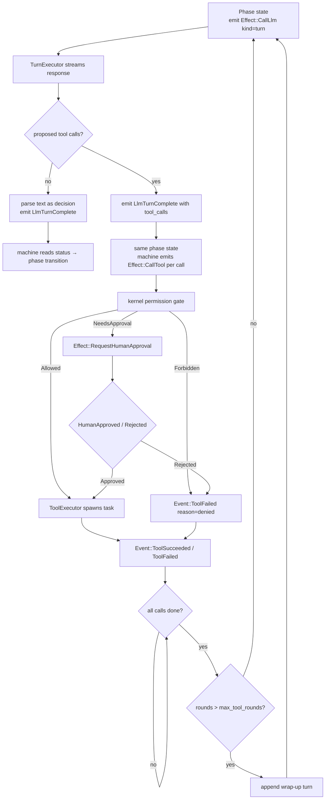

# The SDLC Deliberation Engine

> `SdlcMachine` implements this design with per-phase in-state tool loops
> (`loop_core`) driven by `TurnExecutor`. See
> [State Machine Reference](state-machines.md) and
> [HSM Architecture](hsm-architecture.md) for machine-level details.

The deliberation engine is how sven's `sdlc` mode does real engineering work
while keeping the [HSM kernel](hsm-architecture.md) as the deterministic
authority over control flow. Each state of the `SdlcMachine` runs a *scoped*
LLM turn followed by kernel-dispatched tool calls - a **turn round** - and
returns a single structured decision. The kernel reads that decision and chooses
the next transition.

This document explains the model precisely: the HSM-as-authority / LLM-as-tool
split, the append-only conversation store and its cache-safety invariant, the
`TurnRequest` shape, the kernel-mediated turn loop, structured output, per-state
tool subsets and models, the decision envelope and how `status` drives
transitions, the SDLC phase walk (including the "hi" intake guard), and the human
question/approval gates.

---

## HSM as authority, LLM as a scoped tool

In a free-running agent, the model decides everything: what to do, which tools to
call, and when to stop. In sven's SDLC mode the responsibility is split:

- **The LLM proposes tool calls within a state.** On each model turn the
  `TurnExecutor` streams a single model response, accumulates proposed tool calls
  (`ProposedToolCall`s), and posts `Event::LlmTurnComplete { text, tool_calls }`.
  The machine then emits one `Effect::CallTool` per proposed call. All tool
  execution happens through the kernel's `ToolExecutor` - not inside any executor
  loop.
- **The HSM decides what happens *between* states and between tool calls.** A
  turn's result does not transition the machine directly. Tool calls come back as
  `ToolSucceeded` / `ToolFailed` events. Only when the model produces a final
  tool-free turn does the machine parse the text as a structured **decision**
  whose `status` field is the only authority signal. The HSM reads `status` and
  picks the transition (advance, ask the user, request approval, re-deliberate, or
  recover).

So the model is powerful *inside* a phase and powerless *across* phases. The
state graph, the gates, the permission policy, the audit trail, and the recovery
hierarchy remain deterministic, auditable, and testable.

```
        Effect::CallLlm { kind: "turn", ... }
SdlcMachine ──────────────────────────────────► TurnExecutor
(HSM state)                                         │
     ▲                                              │ streams model response
     │                                              │ accumulates tool_calls
     │  Event::LlmTurnComplete { text, tool_calls } │
     ◄──────────────────────────────────────────────┘
     │
     │  emits Effect::CallTool per proposed call
     ▼
     kernel permission gate (PermissionPolicy)
     │  Allowed → ToolExecutor.execute (spawn-and-forget)
     │  Forbidden → Event::ToolFailed { reason: "denied" }
     │  NeedsApproval → Effect::RequestHumanApproval
     ▼
     Event::ToolSucceeded / ToolFailed → machine re-prompts or parses decision
```

No executor runs a multi-step tool loop or executes tools off-book. The kernel is
the single policy evaluator and the audit trail captures every tool I/O entry.

---

## The conversation store and the append-only invariant

Each SDLC thread (`intake`, `discovery`, `planning`, `execution`,
`verification`, `delivery`, `recovery`, and `task` for fan-out children) has its
own conversation history, owned for the lifetime of the runtime by a
`ThreadStore` (`executors/src/thread_store.rs`):

```rust,ignore
pub struct ThreadStore {
    threads: HashMap<ThreadId, Vec<Message>>,
}
```

The store is **append-only** during normal turns: turns are added with `append`
(or pushed through the `thread()` accessor) and earlier turns are never
rewritten or removed. The one escape hatch, `replace_thread`, is used only when
a history is deliberately re-seeded (resume, edit-and-resubmit) or compacted
(see [Prompt Compaction](prompt-compaction.md)). This is the **cache-safety invariant**: because the prefix
of each thread never changes, the model provider's prompt cache stays valid
across successive deliberations on the same thread, which keeps cost and latency
down on long engagements.

Cross-state and cross-submachine context is carried the same way - by *appending
a new user turn* to the destination thread, never by editing history. For
example, when parallel execution children finish, the parent appends a single
synthesis turn summarising their results to the `execution` thread rather than
splicing anything into earlier messages.

A thread accumulates, in order: the per-turn instruction (a user turn, with the
SDLC prompts prepending the phase's role framing), assistant text, assistant
tool-call messages, and tool-result messages.

---

## The `TurnRequest`

A state asks for a model turn by emitting `Effect::CallLlm` whose opaque
`request` value carries a `kind: "turn"` discriminator. The wire shape mirrors
`TurnRequest` (`vocab/src/turn.rs`):

| Field | Meaning |
|-------|---------|
| `thread` | Stable thread id (e.g. `"intake"`) selecting which append-only history to use |
| `instruction` | The comprehensive per-turn command, appended as a new user turn |
| `tools` | Names of the tools available to the model this turn (state-scoped subset) |
| `all_tools_mode` | When `tools` is empty, resolve every tool for this mode instead |
| `schema` | JSON Schema the final response must conform to (may be null) |
| `schema_name` | Short schema name (used for OpenAI strict mode) |
| `model` | Optional per-state model override (resolved via the model resolver) |
| `dynamic_suffix` | Volatile context sent as an uncached system block where supported |
| `max_tool_rounds` | Maximum model↔tool rounds before a forced wrap-up |
| `refused_calls` | Tool calls refused before they ran; answered in the thread before the model is called |

`TurnRequest::is_turn` checks the `kind` tag; the `CompositeExecutor` uses it to
route the effect to the `TurnExecutor`.

The `SdlcMachine`'s prompts (`machines/src/machines/sdlc/prompts.rs`) build
these values directly with the same wire shape. The **instruction is a real
command, not raw JSON** - it frames the role, summarises the process step, states
the explicit task, and tells the model how to answer.

---

## The kernel-mediated turn loop

`TurnExecutor` (`executors/src/turn.rs`) deserialises the request, resolves
the model (honouring a per-state override when a resolver is present), resolves
the tool subset against the live registry (`ToolRegistry::schemas_for_names`),
builds a `ResponseFormat` from the schema, and calls `stream_turn`
(`turn/src/stream_turn.rs`) against the thread.

`stream_turn` performs a **single model pass**: it streams `TextDelta` /
`ThinkingDelta` as `UiEvent`s and accumulates proposed tool calls - it does
**not** dispatch tools. Accumulated calls come back as `ProposedToolCall`s in
`LlmTurnComplete`.

The machine (`SdlcMachine` / `TaskMachine`) then drives the loop using the shared
`loop_core` helpers (`machines/src/machines/loop_core.rs`), staying in the
current phase state while tools run:



Key behaviours:

- **Streaming.** Each `TurnExecutor` pass streams `TextDelta`/`ThinkingDelta` and
  tool progress as `UiEvent`s on the outward observation plane. The **final
  tool-free text is *not* forwarded** as `TextComplete` when it is the raw
  structured decision - the machine parses it internally.
- **Parallel tools.** All `Effect::CallTool`s emitted by the machine for one
  model turn are handed concurrently to the `ToolExecutor`'s
  spawn-and-forget tasks. Results arrive back as `ToolSucceeded` / `ToolFailed`
  events in whatever order the tasks finish.
- **Kernel-gated.** Every tool call passes through the `PermissionPolicy` before
  `ToolExecutor` sees it. Forbidden calls produce `ToolFailed{reason:"denied"}`
  without touching the registry. The kernel is the single policy evaluator.
- **Append-only.** `TurnExecutor` appends the assistant turn (text + tool-call
  messages) to the thread. `ToolExecutor` appends tool-result messages when a
  `call_id → thread` mapping exists. Neither ever mutates prior messages.
- **Round budget.** The machine's `loop_core` tracks a round counter; when
  `rounds` exceeds `max_tool_rounds`, it appends a wrap-up user turn
  instructing the model to stop calling tools and emit its final decision.
- **Cancellation.** A shared cancel slot allows the TUI to abort an in-flight
  turn; the machine transitions to `Idle` / `Cancelled` on `UserCancelled`.

When the final tool-free turn arrives, the machine parses the accumulated text
into the decision JSON and drives its phase transition. On a model error it routes
to recovery via `Event::LlmFailed`.

---

## Structured output: three layers of robustness

A deliberation must end with a JSON decision, so structured output is enforced
with belt-and-braces across heterogeneous providers:

1. **`response_format`** - when the request carries a non-null schema, the
   executor sets `CompletionRequest.response_format = JsonSchema { name, schema }`.
   Drivers that support it (OpenAI / OpenRouter) add a `response_format` field so
   the model is constrained to valid JSON / the schema. Drivers that don't support
   it ignore the field.
2. **Prompt fallback.** Every instruction also describes the decision contract in
   prose (the shared "answer contract" tail in `prompts.rs`), so models without
   `response_format` support still know the required shape.
3. **Post-parse.** The machine always post-parses the final text
   (`parse_sdlc_decision` in `decisions.rs`): it strips Markdown code fences and, if the whole string
   isn't valid JSON, extracts the first balanced top-level `{ … }` object
   (ignoring braces inside strings). This tolerates models that wrap JSON in
   fences or surround it with prose.

This layering means structured output behaves uniformly regardless of which
provider backs the session.

---

## Per-state tool subsets and models

Each state restricts what the model can touch:

- **Tool subset.** The request's `tools` list names the allowed tools, resolved
  against the live registry with `ToolRegistry::schemas_for_names` (unknown names
  are skipped). The SDLC prompts define three subsets:
  - `READ_TOOLS` - `read_file`, `find_file`, `grep` (Intake, Discovery, Planning, Delivery,
    Recovery).
  - `WRITE_TOOLS` - the read tools plus `write_file`, `edit_file` and `shell`
    (Execution and execution follow-ups, and each fan-out task).
  - `BUILD_TOOLS` - read tools plus `shell` for build/test (Verification).
- **Per-state model.** The request's `model` field may name a model; the executor
  resolves it via the `ModelResolver` and falls back to the default model on
  error. (The shipped prompts leave it null, so every phase uses the session
  default, but the mechanism is wired end to end.)

Tool calls flow through the kernel as `Effect::CallTool` and are fully gated
by the per-state `PermissionPolicy` before `ToolExecutor` executes them; the
kernel permission gate is the single enforcer for SDLC tool use.
`AskUser` and `RequestHumanApproval` effects continue to gate phase-level
decisions (scope confirmation, plan approval, delivery sign-off).

---

## The decision envelope

Every deliberation returns a JSON object matching the shared schema
(`machines/src/machines/sdlc/decisions.rs`). The authority field is `status`:

| `status` | Machine behaviour |
|----------|-------------------|
| `proceed` | Advance autonomously to the next phase |
| `need_user_input` | Pause; ask the developer the listed `questions` (via `AskUser`) |
| `need_approval` | Pause; request human approval (`approval_prompt`, via `RequestHumanApproval`) |
| `need_tools` | Re-deliberate once more on the same thread (the loop runs tools internally) |
| `failed` | Bubble to the `Recovery` state |

Other fields are advisory: `summary` (what the phase concluded), `message`
(user-facing text, e.g. a chit-chat reply), `questions` (clarifications),
`approval_prompt` (what is being approved), and `payload` (phase-specific
structured result: discovery findings, the plan + task list, the verification
verdict, …).

Parsing is deliberately **tolerant and fail-safe**: an unknown or missing
`status` is treated as `failed`, so a malformed decision routes to recovery
rather than silently advancing.

The machine stores each phase's `summary` and `payload` as facts (e.g.
`scope_summary`, `discovery_summary`, `plan_payload`) so the next phase's
instruction can reference them.

---

## The SDLC phase walk

`SdlcMachine` (`machines/src/machines/sdlc/mod.rs`) is a flat hierarchy whose
single superstate is `Top` (which handles global `UserCancelled` → `Cancelled`).
Each phase handler is self-contained: it issues its deliberation on `Entry`,
routes the decision from the final tool-free `LlmTurnComplete` by `status`, re-deliberates on a developer
`UserMessage` (carrying the answer forward append-only via `followup_request`),
and handles approval replies inline.

### `Idle` - the "hi" intake guard

The machine's initial state is `Idle`, and it fires **no LLM call** until the
developer actually speaks. The first `UserMessage` stores the text as the
`user_request` fact and transitions to `Intake`. This is the first half of the
guard against doing work for a bare greeting.

### Intake - classify before working

On entry, Intake deliberates with the intake instruction. The decision routing
is the second half of the "hi" guard:

- **Greeting / small talk** → the model replies warmly in `message` and returns
  `need_user_input` inviting the developer to describe a task. **No engineering
  work starts.**
- **Actionable but under-specified** → `need_user_input` with specific
  `questions`. The machine emits `AskUser`; the developer's reply comes back as a
  `UserMessage`, which triggers a follow-up deliberation on the same `intake`
  thread.
- **Clear, actionable scope** → the model summarises the problem/intent/
  constraints and returns `need_approval` with an `approval_prompt` restating the
  scope. Only a confirmed scope advances: `HumanApproved` → `Discovery`.

So chit-chat and insufficient information keep the machine in Intake asking
questions; only a confirmed actionable scope moves forward.

### Discovery → Planning → Execution → Verification → Delivery

Each subsequent phase follows the same pattern with its own thread, role, tool
subset, and instruction:

- **Discovery** (read-only tools) explores the repo and produces a discovery
  summary; `proceed` → Planning.
- **Planning** (read-only tools) produces a minimal plan decomposed into atomic
  tasks in `payload.tasks`, and returns `need_approval`; `HumanApproved` →
  Execution.
- **Execution** (write/build tools) implements the plan. If the approved plan
  decomposes into ≥2 tasks **and** a child spawner is installed (the
  `parallel_execution` fact is set), Execution **fans out** one child submachine
  per task and runs them concurrently, then merges their summaries back into the
  execution thread append-only before re-deliberating. Otherwise it runs a single
  deliberation. `proceed` → Verification. (Fan-out details:
  [Parallel Submachine Fan-out](parallel-submachines.md).)
- **Verification** (build/test tools) independently builds, tests, and checks the
  work; `proceed` → Delivery, `failed` → Recovery.
- **Delivery** (read-only tools) writes the final handover and returns
  `need_approval`; `HumanApproved` → `Done`.

### Recovery - diagnose and retry through the hierarchy

Any phase that returns `failed` (or whose deliberation errors via `LlmFailed`)
routes to `Recovery` via the `to_recovery` helper, which records `failed_phase`
and `failure_context` facts. Recovery deliberates a diagnosis:

- `proceed` → retry the recorded failed phase from scratch,
- `need_user_input` → ask the developer,
- anything else → `Failed`.

A retry counter (`bump_retry("recovery")`) caps attempts at `MAX_RECOVERY` (3);
exceeding it transitions to the terminal `Failed` state. `Done`, `Failed`, and
`Cancelled` are terminal.

---

## Human question and approval gates

The SDLC gates reuse the kernel's existing UI channels - they are real effects,
not loop-internal prompts:

- **Questions** (`need_user_input`) emit `Effect::AskUser { prompt }`, built from
  the decision's `message` + `questions`. The `UserExecutor` surfaces it on the
  question channel; the developer's answer returns as a `UserMessage` and feeds a
  follow-up deliberation on the current thread.
- **Approvals** (`need_approval`) record a `PendingApproval` in the context and
  emit `Effect::RequestHumanApproval { approval_id, capability, description }`
  (capability `GitOperation`). The `UserExecutor` surfaces it on the approval
  channel; `HumanApproved` advances the phase (and grants the capability via
  `ctx.approve`), while `HumanRejected` either revises (Intake, Planning,
  Delivery re-deliberate with a `revise_request`) or routes to Recovery.

In **CI / headless** mode the `RuntimeRunner` auto-approves every gate (questions
get an empty answer, approvals get `true`), so the same gated flow runs
unattended without changing the machine.

---

## Where this fits

- The kernel mechanics (events, effects, dispatch, permission gate, runtime,
  observation plane) are in **[HSM Architecture](hsm-architecture.md)**.
- The concurrent execution fan-out that Execution uses is in **[Parallel
  Submachine Fan-out](parallel-submachines.md)**.

Source of truth in code:

- `machines/src/machines/sdlc/` - `mod.rs` (the machine), `prompts.rs`
  (instructions + subsets), `decisions.rs` (the envelope + schema), `task.rs`
  (the fan-out child).
- `machines/src/machines/loop_core.rs` - the shared in-state model↔tool loop
  helpers and `LoopState`.
- `turn/src/stream_turn.rs` - `stream_turn` (single-pass model streaming).
- `executors/src/turn.rs` - `TurnExecutor`.
- `executors/src/tool.rs` - `ToolExecutor` (spawn-and-forget, appends
  results to the right thread via the `call_id → thread` registry).
- `executors/src/thread_store.rs` - `ThreadStore`; `vocab/src/turn.rs` -
  `TurnRequest`.
- `model/src/types.rs` - `ResponseFormat` + `response_format` on
  `CompletionRequest`.
- `tool-registry/src/registry.rs` - `schemas_for_names` (the tool-subset API).
