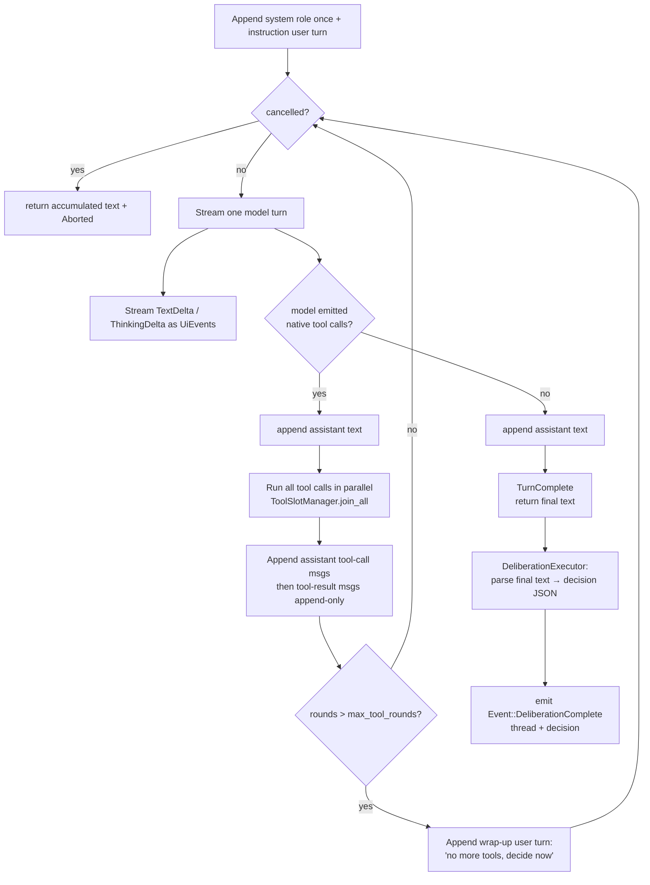

# The SDLC Deliberation Engine

The deliberation engine is how sven's `sdlc` mode does real engineering work
while keeping the [HSM kernel](hsm-architecture.md) as the deterministic
authority over control flow. Each state of the `SdlcMachine` runs a *scoped*
LLM↔tool agentic loop - a **deliberation** - and returns a single structured
decision. The kernel reads that decision and chooses the next transition.

This document explains the model precisely: the HSM-as-authority / LLM-as-tool
split, the append-only conversation store and its cache-safety invariant, the
`DeliberationRequest` shape, the `Deliberator` loop, structured output, per-state
tool subsets and models, the decision envelope and how `status` drives
transitions, the SDLC phase walk (including the "hi" intake guard), and the human
question/approval gates.

---

## HSM as authority, LLM as a scoped tool

In a free-running agent, the model decides everything: what to do, which tools to
call, and when to stop. In sven's SDLC mode the responsibility is split:

- **The LLM runs the loop *within* a state.** Inside a deliberation the model
  streams reasoning and makes **native tool calls** (read, grep, edit, shell, …)
  that are executed and fed back into the conversation, just like any agentic
  coding assistant. This is genuine tool use - not the older "the LLM only fills
  in a JSON field and never names a tool" model.
- **The HSM decides what happens *between* states.** A deliberation does not
  transition the machine. It ends by emitting a structured **decision** whose
  `status` field is the only authority signal. The HSM reads `status` and picks
  the transition (advance, ask the user, request approval, re-deliberate, or
  recover).

So the model is powerful *inside* a phase and powerless *across* phases. The
state graph, the gates, and the recovery hierarchy remain deterministic,
auditable, and testable.

```
            Effect::CallLlm { kind: "deliberate", ... }
   SdlcMachine ───────────────────────────────────────► DeliberationExecutor
   (HSM state)                                                    │
        ▲                                                         │ runs Deliberator loop
        │                                                         │ (stream + native tools)
        │   Event::DeliberationComplete { thread, decision }      ▼
        └───────────────────────────────────────────────  structured decision (JSON)
        the HSM reads decision.status and transitions
```

---

## The conversation store and the append-only invariant

Each SDLC thread (`intake`, `discovery`, `planning`, `execution`,
`verification`, `delivery`, `recovery`, and `task` for fan-out children) has its
own conversation history, owned for the lifetime of the runtime by a
`ConversationStore` (`sven-llm/src/conversation.rs`):

```rust,ignore
pub struct ConversationStore {
    threads: HashMap<ThreadId, Vec<Message>>,
}
```

The store is **append-only**. The only mutation exposed is `append` (and a
`thread()` accessor that callers must only push onto); earlier turns are never
rewritten or removed. This is the **cache-safety invariant**: because the prefix
of each thread never changes, the model provider's prompt cache stays valid
across successive deliberations on the same thread, which keeps cost and latency
down on long engagements.

Cross-state and cross-submachine context is carried the same way - by *appending
a new user turn* to the destination thread, never by editing history. For
example, when parallel execution children finish, the parent appends a single
synthesis turn summarising their results to the `execution` thread rather than
splicing anything into earlier messages.

A thread accumulates, in order: the system role (pushed once, when the thread is
empty), the per-turn instruction (a user turn), assistant text, assistant
tool-call messages, and tool-result messages.

---

## The `DeliberationRequest`

A state asks for a deliberation by emitting `Effect::CallLlm` whose opaque
`request` value carries a `kind: "deliberate"` discriminator. The wire shape
mirrors `DeliberationRequest` (`sven-llm/src/conversation.rs`):

| Field | Meaning |
|-------|---------|
| `thread` | Stable thread id (e.g. `"intake"`) selecting which append-only history to use |
| `system_role` | Stable system-role framing for the thread (pushed once, cached) |
| `instruction` | The comprehensive per-turn command, appended as a new user turn |
| `tools` | Names of the tools this deliberation may call (the state-scoped subset) |
| `schema` | JSON Schema the structured decision must conform to (may be null) |
| `schema_name` | Short schema name (used for OpenAI strict mode) |
| `model` | Optional per-state model override (resolved via the model resolver) |
| `max_tool_rounds` | Maximum model↔tool rounds before a forced wrap-up turn |

`DeliberationRequest::is_deliberation` checks the `kind` tag; the
`CompositeExecutor` uses it to route the effect to the `DeliberationExecutor`
rather than the converse or typed-LLM executors.

The `SdlcMachine`'s prompts (`sven-core/src/machines/sdlc/prompts.rs`) build
these values directly with the same wire shape. The **instruction is a real
command, not raw JSON** - it frames the role, summarises the process step, states
the explicit task, and tells the model how to answer.

---

## The `Deliberator` loop

`DeliberationExecutor` (`sven-executors/src/deliberation.rs`) deserialises the
request, resolves the model (honouring a per-state override when a resolver is
present, else the default), resolves the tool subset against the live registry
(`ToolRegistry::schemas_for_names`), builds a `ResponseFormat` from the schema,
and runs the reusable `Deliberator` (`sven-core/src/deliberator.rs`) against the
thread.

The `Deliberator` generalises the same model↔tool loop that drives the converse
`Agent`, keeping only what a short, single-model, state-scoped deliberation
needs: streaming, parallel tool dispatch (via `ToolSlotManager`),
`max_tool_rounds` wrap-up, tool-output truncation, and cancellation.



Key behaviours:

- **Streaming.** Each model turn streams `TextDelta`/`ThinkingDelta` and tool
  progress as `AgentEvent`s, which the executor bridges to `UiEvent`s on the
  observation plane. The **final tool-free text is *not* forwarded** as
  `TextComplete` - it is the raw structured decision and must not leak to the UI.
- **Parallel tools.** When a turn contains multiple tool calls they are
  dispatched and awaited concurrently; an Anthropic-style inline `<invoke>`
  fallback recovers tool calls from models that emit XML.
- **Append-only.** Assistant text, assistant tool-call messages, and tool
  results are only ever pushed onto the thread (tool results are smart-truncated
  to a per-result token cap first).
- **Round budget.** Once `rounds` exceeds `max_tool_rounds`, the loop appends a
  wrap-up user turn instructing the model to stop calling tools and emit its
  final decision, then runs one tool-free turn.
- **Cancellation.** A shared cancel slot (the same mechanism the TUI uses for the
  converse engine) aborts the in-flight deliberation; the loop returns whatever
  text it had accumulated and emits `Aborted`.

When the loop returns the final tool-free text, the executor parses it into the
decision JSON and posts `Event::DeliberationComplete { thread, decision }` back
into the kernel. On a model error or unparsable decision it instead posts
`Event::LlmFailed`, which the machine routes to recovery.

---

## Structured output: three layers of robustness

A deliberation must end with a JSON decision, so structured output is enforced
with belt-and-braces across heterogeneous providers:

1. **`response_format`** - when the request carries a non-null schema, the
   executor sets `CompletionRequest.response_format = JsonSchema { name, schema }`.
   Drivers that support it (OpenAI / OpenRouter) add a `response_format` field so
   the model is constrained to valid JSON / the schema. Drivers that don't support
   it ignore the field.
2. **Prompt fallback.** Every instruction also describes the decision contract in
   prose (the shared "answer contract" tail in `prompts.rs`), so models without
   `response_format` support still know the required shape.
3. **Post-parse.** The executor always post-parses the final text
   (`parse_decision`): it strips Markdown code fences and, if the whole string
   isn't valid JSON, extracts the first balanced top-level `{ … }` object
   (ignoring braces inside strings). This tolerates models that wrap JSON in
   fences or surround it with prose.

This layering means structured output behaves uniformly regardless of which
provider backs the session.

---

## Per-state tool subsets and models

Each state restricts what the model can touch:

- **Tool subset.** The request's `tools` list names the allowed tools, resolved
  against the live registry with `ToolRegistry::schemas_for_names` (unknown names
  are skipped). The SDLC prompts define three subsets:
  - `READ_TOOLS` - `read_file`, `find_file`, `grep`, `search_codebase`,
    `read_lints`, `list_dir`, `glob` (Intake, Discovery, Planning, Delivery,
    Recovery).
  - `WRITE_TOOLS` - the read tools plus `edit_file`, `delete_file`, `shell`,
    `run_terminal_command` (Execution and execution follow-ups, and each fan-out
    task).
  - `BUILD_TOOLS` - read tools plus `shell` / `run_terminal_command` for
    build/test (Verification).
- **Per-state model.** The request's `model` field may name a model; the executor
  resolves it via the `ModelResolver` and falls back to the default model on
  error. (The shipped prompts leave it null, so every phase uses the session
  default, but the mechanism is wired end to end.)

Because deliberation tools run *inside the loop* via the `ToolRegistry`, they are
not gated by the kernel's per-state `PermissionPolicy` (which only sees
kernel-level `Effect::CallTool`). Tool approval for these calls is enforced by
the registry's own `ApprovalPolicy` / `PermissionRequester`. The kernel's gates
that *do* fire in SDLC mode are the `AskUser` and `RequestHumanApproval` effects
the machine emits between deliberations.

---

## The decision envelope

Every deliberation returns a JSON object matching the shared schema
(`sven-core/src/machines/sdlc/decisions.rs`). The authority field is `status`:

| `status` | Machine behaviour |
|----------|-------------------|
| `proceed` | Advance autonomously to the next phase |
| `need_user_input` | Pause; ask the developer the listed `questions` (via `AskUser`) |
| `need_approval` | Pause; request human approval (`approval_prompt`, via `RequestHumanApproval`) |
| `need_tools` | Re-deliberate once more on the same thread (the loop runs tools internally) |
| `failed` | Bubble to the `Recovery` state |

Other fields are advisory: `summary` (what the phase concluded), `message`
(user-facing text, e.g. a chit-chat reply), `questions` (clarifications),
`approval_prompt` (what is being approved), and `payload` (phase-specific
structured result: discovery findings, the plan + task list, the verification
verdict, …).

Parsing is deliberately **tolerant and fail-safe**: an unknown or missing
`status` is treated as `failed`, so a malformed decision routes to recovery
rather than silently advancing.

The machine stores each phase's `summary` and `payload` as facts (e.g.
`scope_summary`, `discovery_summary`, `plan_payload`) so the next phase's
instruction can reference them.

---

## The SDLC phase walk

`SdlcMachine` (`sven-core/src/machines/sdlc/mod.rs`) is a flat hierarchy whose
single superstate is `Top` (which handles global `UserCancelled` → `Cancelled`).
Each phase handler is self-contained: it issues its deliberation on `Entry`,
routes `DeliberationComplete` by `status`, re-deliberates on a developer
`UserMessage` (carrying the answer forward append-only via `followup_request`),
and handles approval replies inline.

### Idle - the "hi" intake guard

The machine's initial state is `Idle`, and it fires **no LLM call** until the
developer actually speaks. The first `UserMessage` stores the text as the
`user_request` fact and transitions to `Intake`. This is the first half of the
guard against doing work for a bare greeting.

### Intake - classify before working

On entry, Intake deliberates with the intake instruction. The decision routing
is the second half of the "hi" guard:

- **Greeting / small talk** → the model replies warmly in `message` and returns
  `need_user_input` inviting the developer to describe a task. **No engineering
  work starts.**
- **Actionable but under-specified** → `need_user_input` with specific
  `questions`. The machine emits `AskUser`; the developer's reply comes back as a
  `UserMessage`, which triggers a follow-up deliberation on the same `intake`
  thread.
- **Clear, actionable scope** → the model summarises the problem/intent/
  constraints and returns `need_approval` with an `approval_prompt` restating the
  scope. Only a confirmed scope advances: `HumanApproved` → `Discovery`.

So chit-chat and insufficient information keep the machine in Intake asking
questions; only a confirmed actionable scope moves forward.

### Discovery → Planning → Execution → Verification → Delivery

Each subsequent phase follows the same pattern with its own thread, role, tool
subset, and instruction:

- **Discovery** (read-only tools) explores the repo and produces a discovery
  summary; `proceed` → Planning.
- **Planning** (read-only tools) produces a minimal plan decomposed into atomic
  tasks in `payload.tasks`, and returns `need_approval`; `HumanApproved` →
  Execution.
- **Execution** (write/build tools) implements the plan. If the approved plan
  decomposes into ≥2 tasks **and** a child spawner is installed (the
  `parallel_execution` fact is set), Execution **fans out** one child submachine
  per task and runs them concurrently, then merges their summaries back into the
  execution thread append-only before re-deliberating. Otherwise it runs a single
  deliberation. `proceed` → Verification. (Fan-out details:
  [Parallel Submachine Fan-out](parallel-submachines.md).)
- **Verification** (build/test tools) independently builds, tests, and checks the
  work; `proceed` → Delivery, `failed` → Recovery.
- **Delivery** (read-only tools) writes the final handover and returns
  `need_approval`; `HumanApproved` → `Done`.

### Recovery - diagnose and retry through the hierarchy

Any phase that returns `failed` (or whose deliberation errors via `LlmFailed`)
routes to `Recovery` via the `to_recovery` helper, which records `failed_phase`
and `failure_context` facts. Recovery deliberates a diagnosis:

- `proceed` → retry the recorded failed phase from scratch,
- `need_user_input` → ask the developer,
- anything else → `Failed`.

A retry counter (`bump_retry("recovery")`) caps attempts at `MAX_RECOVERY` (3);
exceeding it transitions to the terminal `Failed` state. `Done`, `Failed`, and
`Cancelled` are terminal.

---

## Human question and approval gates

The SDLC gates reuse the kernel's existing UI channels - they are real effects,
not loop-internal prompts:

- **Questions** (`need_user_input`) emit `Effect::AskUser { prompt }`, built from
  the decision's `message` + `questions`. The `UserExecutor` surfaces it on the
  question channel; the developer's answer returns as a `UserMessage` and feeds a
  follow-up deliberation on the current thread.
- **Approvals** (`need_approval`) record a `PendingApproval` in the context and
  emit `Effect::RequestHumanApproval { approval_id, capability, description }`
  (capability `GitOperation`). The `UserExecutor` surfaces it on the approval
  channel; `HumanApproved` advances the phase (and grants the capability via
  `ctx.approve`), while `HumanRejected` either revises (Intake, Planning,
  Delivery re-deliberate with a `revise_request`) or routes to Recovery.

In **CI / headless** mode the `RuntimeRunner` auto-approves every gate (questions
get an empty answer, approvals get `true`), so the same gated flow runs
unattended without changing the machine.

---

## Where this fits

- The kernel mechanics (events, effects, dispatch, permission gate, runtime,
  observation plane) are in **[HSM Architecture](hsm-architecture.md)**.
- The concurrent execution fan-out that Execution uses is in **[Parallel
  Submachine Fan-out](parallel-submachines.md)**.

Source of truth in code:

- `sven-core/src/machines/sdlc/` - `mod.rs` (the machine), `prompts.rs`
  (instructions + subsets), `decisions.rs` (the envelope + schema), `task.rs`
  (the fan-out child).
- `sven-core/src/deliberator.rs` - the reusable loop.
- `sven-executors/src/deliberation.rs` - the executor + decision parsing.
- `sven-llm/src/conversation.rs` - `ConversationStore` + `DeliberationRequest`.
- `sven-model/src/types.rs` - `ResponseFormat` + `response_format` on
  `CompletionRequest`.
- `sven-tools/src/registry.rs` - `schemas_for_names` (the tool-subset API).
