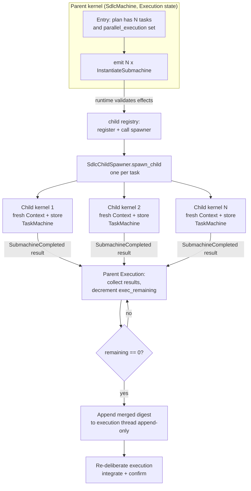

# Parallel Submachine Fan-out

When the SDLC machine's approved plan decomposes into several independent tasks,
sven runs them **concurrently** - each task in its own isolated child kernel -
and merges the results back into the parent. This document describes the kernel
machinery that makes that possible (`ChildSpawner`, the contract every child
runs under, the child registry, `spawn_with_children`, isolated child
contexts, and the `SubmachineCompleted` result payload), the one-shot
`TaskMachine`, the production `SdlcChildSpawner`, how a child reaches the
parent's human gates, and the Execution fan-out/aggregation flow.

For the kernel basics this builds on, see [HSM Architecture](hsm-architecture.md);
for the SDLC phases that drive it, see [Deliberation Engine](deliberation-engine.md).

---

## Why concurrent child kernels

The kernel already supports an *in-process* child (`Submachine<P>`), but that
runs the child synchronously inside the parent's dispatch - fine for a single
nested workflow, wrong for parallelism. To run N tasks at once without blocking
the parent's single run-to-completion consumer loop, each task gets its **own
`Runtime`**: its own event queue, its own consumer task, and its own `Context`
and conversation store. The parent stays responsive and the tasks make progress
simultaneously.

`Effect::InstantiateSubmachine` was previously a no-op. It is now genuinely
implemented at the runtime layer, and `InternalEvent::SubmachineCompleted`
carries a `result` payload so a finished child can hand its structured output
back to the parent for append-only aggregation.

---

## Kernel building blocks

### `ChildSpawner`

The kernel is machine-agnostic, so it cannot build a concrete child from an
opaque descriptor. The `ChildSpawner` trait (`kernel/src/children.rs`) bridges
that gap:

```rust,ignore
#[async_trait]
pub trait ChildSpawner: Send + Sync {
    async fn spawn_child(
        &self,
        machine: MachineId,
        descriptor: Value,
        run: ChildRun,
        parent: EventSink,
    );
}

pub struct ChildRun {
    pub contract: ChildRunContract,
    pub cancel: CancelScope,
}
```

Given the parent-assigned `MachineId`, the opaque `descriptor` (which names the
work), the `ChildRun` terms, and a clone of the parent's `EventSink`, an
implementation must run the child **concurrently on its own task with an
isolated `Context`** under `run.contract`, stop it when `run.cancel` is
cancelled, and, when the child ends, post
`Event::Internal(InternalEvent::SubmachineCompleted { machine, result })` back to
the parent. `spawn_child` must return promptly (spawn-and-forget); the long child
work belongs on the task it spawns, never inline - that is what keeps fan-out
parallel.

### The contract a child runs under

A child inherits its parent's authority and can only narrow it. The kernel
builds `run.contract` (`hsm/src/contract.rs`) from what the parent's policy
allows in the state that emitted `InstantiateSubmachine`, narrowed by the
parent's own contract when the parent is itself a child. A spawner narrows it
further with its own terms through `ChildRunContract::narrow`, which keeps a
capability only where both sides allow it, keeps every approval requirement,
and takes the tighter of each budget (`max_tool_rounds`, `max_output_tokens`)
and the earlier deadline. A child starts with a fresh `Context`, so it holds
none of the parent's granted approvals.

`ErasedRuntime::spawn_child_run` starts an in-process child under those terms:
the runtime's policy is the contract's, the child's cancel scope is cancelled
at the contract's deadline, and the child's own children inherit no more than
it holds. Starting a child needs `ToolCapability::SpawnChild` in the parent's
current state, so a child whose inherited policy lacks it cannot fan out
again.

### `spawn_with_children` and the child registry

Both `Runtime<M>` and `ErasedRuntime` expose `spawn_with_children`, which takes an
optional `Arc<dyn ChildSpawner>`. Inside the consumer loop:

- After each dispatch, the effect batch is validated as usual; each allowed
  `Effect::InstantiateSubmachine` gets a cancel scope derived from the
  runtime's own, which is recorded in the **child registry**
  (`HashMap<MachineId, CancelScope>`), and is handed to
  `spawner.spawn_child(...)` with the contract; every other effect goes to
  the executor.
- Before each dispatch, a `SubmachineCompleted` event removes its child from
  the registry.
- Cancelling the parent (`cancel()`) cancels every child through the derived
  scopes. When the parent's loop ends for any reason - a terminal state,
  `cancel`, `abort`, the handle being dropped - the registry is dropped and
  cancels every child still live, so no child outlives its parent.

If **no** spawner is configured, `InstantiateSubmachine` effects are left in
place and flow to the `EffectExecutor` - preserving the historical no-op so every
existing caller behaves unchanged. (The `CompositeExecutor` then merely logs a
warning for them.) Aggregation itself lives in the *parent machine*, which owns
the append-only thread; the kernel only tracks liveness.

### Isolated child `Context` and the `result` payload

Each child runs with a **fresh `Context`** - its own facts, conversation store,
audit trail, and retry counters - so children never share mutable state. The
child's output travels back to the parent solely through the `result`
field of `SubmachineCompleted` (which defaults to `Null` for children that
produce no structured result). The parent consumes that payload and appends a
synthesis turn to its own thread; it never reaches into a child's state.



---

## The `TaskMachine`

`TaskMachine` (`machines/src/machines/sdlc/task.rs`) is the one-shot child the
SDLC parent fans out to. It uses the `loop_core` helpers to run a
kernel-mediated multi-round turn loop for a single task on its own isolated
`task` conversation thread, then completes:

```
Top
├── Run   ← loop_core turn loop, tools and waits for a person in-state
└── Done   ← terminal; stores the result fact "out"
```

On `Entry`, `Run` emits a `task` turn request (`prompts::task_request`, with the
write/build tool subset) via `Effect::CallLlm { kind: "turn" }`, with at most
40 tool rounds - fewer when the spawner seeds a smaller
`agent.max_tool_rounds` fact from the child's contract. Tool calls come back
through the kernel as `ToolSucceeded` / `ToolFailed` events, each gated by the
child's permission policy, and are handled in-state by `loop_core`'s
`handle_tool_event`. When the model produces a final tool-free turn,
`TaskMachine` writes its result to the `out` fact (the `RESULT_FACT`):

```json
{ "task": "...", "summary": "...", "ok": true, "payload": { ... } }
```

`ok` is `true` only when the decision `status` is `proceed`. A decision of
`need_user_input` or `need_approval` asks a person when the child can reach
one (see [Children and the parent's human gates](#children-and-the-parents-human-gates))
and ends the task with `ok: false` when it cannot. On `LlmFailed` it records
`ok: false` and still transitions to `Done`.

---

## The production `SdlcChildSpawner`

`SdlcChildSpawner` (`bootstrap/src/child_spawner.rs`) is the production
`ChildSpawner` for SDLC fan-out. For each task it builds a **fully isolated child
kernel**:

- a fresh `Context`,
- a `TurnExecutor` with its own isolated `ThreadStore` and
  `call_id → thread` registry, its output tokens capped by the contract,
- a `CompositeExecutor` with `TurnExecutor` + `ToolExecutor` + timers, and a
  `UserExecutor` on the parent's gate channels when the parent has them,
- a one-shot `TaskMachine` (using `loop_core` state handlers) started with
  `ErasedRuntime::spawn_child_run`,
- the inherited contract narrowed by the spawner's terms for a task: `ReadFile`,
  `WriteFile`, `ExecuteShell`, `GitOperation` and `NetworkAccess`, each only if
  the parent holds it in `Execution` (the SDLC policy grants no network there,
  so children have none), at most `agent.max_tool_rounds` rounds, and a
  wall-clock budget of `agent.child_run_timeout_secs` (default 3600, 0 = none).
  `ExecuteShell` stays approval-gated in the child.

Cancelling the child - the parent is cancelled or shut down, or the deadline
passes - stops its turn in flight and aborts its tool calls in flight.

It spawns the child runtime and a **spawn-and-forget** harvester task that waits
for the child to finish, reads the `out` fact, and posts
`SubmachineCompleted { machine, result }` to the parent. A child stopped before
it wrote `out` reports `ok: false` with the reason: its wall-clock budget ran
out, or it was cancelled with its parent. Because the harvest runs on its own
task, the parent loop is never blocked and siblings run concurrently.

`RuntimeBuilder` installs an `SdlcChildSpawner` only in `sdlc` mode, and only
then seeds the parent's `parallel_execution` fact - so a runtime without a
spawner never emits orphaned `InstantiateSubmachine` effects.

---

## The Execution fan-out / aggregation flow

Fan-out lives entirely in the `Execution` state of the `SdlcMachine`
(`machines/src/machines/sdlc/mod.rs`):

1. **Decide to fan out.** On `Entry`, Execution reads `plan_payload` and extracts
   its `tasks` array (`tasks_of`). `should_fan_out` is true when there are **≥2
   tasks** and the `parallel_execution` fact is set (i.e. a spawner is installed).
2. **Fan out.** It seeds `exec_remaining = tasks.len()` and `exec_results = []`,
   then emits one `Effect::InstantiateSubmachine { machine: new id, descriptor: {
   index, task } }` per task. The runtime hands each to the `SdlcChildSpawner`.
3. **Aggregate.** Each child completion arrives as
   `InternalEvent::SubmachineCompleted { result }`. Execution pushes `result` into
   `exec_results` and decrements `exec_remaining`. While `remaining > 0` it simply
   `Reaction::handled()` (waits for more).
4. **Synthesise.** When the last child reports, it merges the per-child summaries
   into a single digest (`merge_child_results`), stores it as `execution_summary`,
   and **appends one synthesis user turn** to the `execution` thread (append-only)
   asking the model to integrate the results, resolve conflicts, and confirm
   completion - i.e. it re-deliberates. From there the normal Execution decision
   routing applies (`proceed` → Verification, etc.).

If the plan is single-track (or no spawner is installed), Execution skips all of
this and runs a single execution deliberation instead.

---

## Children and the parent's human gates

`RuntimeBuilder` gives the `SdlcChildSpawner` the parent session's own question
and approval channels (`with_gates`), the ones its `UserExecutor` answers
through and that `KernelChannels` hands to the host. Each child gets a
`UserExecutor` on those same channels and the `task.human_gate` fact, so:

- a decision of `need_user_input` becomes `Effect::AskUser`; the child waits
  in `Run`, and the answer arrives as `UserMessage` and goes to the model in a
  follow-up turn;
- a decision of `need_approval` becomes `Effect::RequestHumanApproval`;
  `HumanApproved` continues the task and `HumanRejected` ends it with
  `ok: false`;
- a tool call that needs approval (`ExecuteShell` always does) is put to the
  same approver through `loop_core`, exactly as in the parent.

The host sees a child's question or approval exactly as it sees the parent's.
The wait is bounded by the child's contract: its deadline or its parent's
cancellation stops the child whether or not the question was answered, and a
question still pending then is withdrawn. The child's `UserExecutor` stops
waiting once the child's kernel is gone (`EventSink::closed`) and drops its
reply receiver; the question bridge sees the kernel's reply channel close and
drops the frontend's in turn; the TUI takes the prompt down when the reply
channel it answers through closes (`overlay::question::watch_withdrawal`).

A spawner built without gates seeds `task.human_gate = false`. A task that
then needs a person ends with `ok: false` and a summary saying a person was
needed and none could be reached; a tool call that needs approval is refused
and the model is told so on its next turn.

---

## Source of truth in code

- `hsm/src/contract.rs` - `ChildRunContract` and `narrow`.
- `hsm/src/permissions.rs` - `ToolCapability::SpawnChild`,
  `PermissionPolicy::ceiling_in` / `intersect`.
- `kernel/src/children.rs` - `ChildSpawner`, `ChildRun`, the child registry
  (`Children`).
- `kernel/src/cancel.rs` - `CancelScope`.
- `kernel/src/erased.rs` - `ErasedRuntime::spawn_child_run`.
- `hsm/src/event.rs` - `InternalEvent::SubmachineCompleted { machine, result }`.
- `hsm/src/submachine.rs` - the synchronous in-process `Submachine<P>` path.
- `kernel/tests/child_spawner.rs` - proves concurrent fan-out and result
  aggregation (peak concurrent children ≥ 2; summed child results).
- `kernel/tests/child_run_contract.rs` - a child never holds more than its
  parent, a state without `SpawnChild` cannot spawn, and a child is stopped
  by its parent's cancellation or shutdown and at its deadline.
- `machines/src/machines/loop_core.rs` - the shared in-state model↔tool loop
  helpers used by `TaskMachine` and `SdlcMachine`.
- `machines/src/machines/sdlc/task.rs` - `TaskMachine`.
- `machines/src/machines/sdlc/mod.rs` - the Execution fan-out/aggregation logic
  (`tasks_of`, `should_fan_out`, `merge_child_results`).
- `bootstrap/src/child_spawner.rs` - `SdlcChildSpawner` (the task terms, the
  child executor, the gate channels); its tests show a child asking the
  parent's gate and completing with the answer.
- `bootstrap/src/runtime_builder.rs` - installs the spawner and the
  `parallel_execution` fact in `sdlc` mode.
